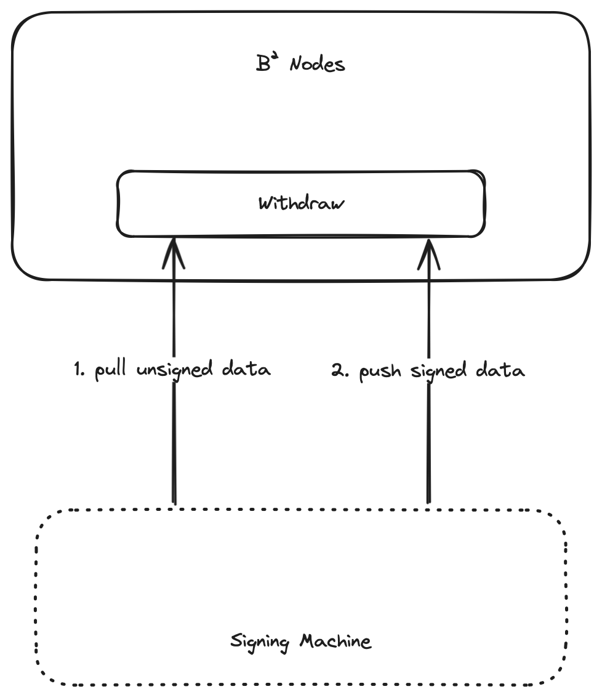

# B² Signing Machine
## Introduction


### Work Flow

1. sign machine pull unsigned btc tx from b2-node
2. sign machine sign btc tx
3. sign machine push signed btc tx sign to b2-node

### Usage

1. config env
> Generate the eth private key and send the eth address to the b2node for authorization

2. build

```shell
make build
```

3. start sign machine

```shell
./build/b2-sign start
```

1. gen multi sig address && script
```shell
./build/b2-sign multi -n 2 -t -x  xpub1,xpub2,xpub3
```

## Resources

- [Signing Machine ENVs list](./docs/ENVS.md)